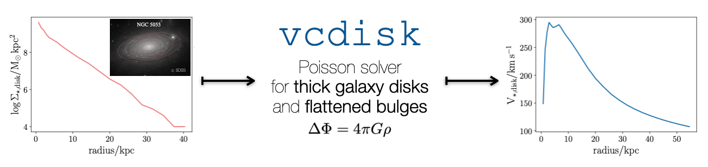

``vcdisk``: Rotation curves of thick galaxy disks
#################################################

A minimal python module to solve Poisson's equation in a thick galactic disk.
This is useful to compute the circular velocity on the disk plane of a galaxy
with observed surface density profile and arbitrary, user-defined vertical profile.

:py:func:`~vcdisk.vcdisk` implements the algorithm of [Casertano83]_, which calculates
the radial force on the disk plane as a 2-D integral (their Eq. 4) and then derives
the velocity of a circular orbit on the disk plane.

Install
=======

The package can be installed using

.. code-block:: bash

   pip install vcdisk

Getting started
===============

.. toctree::
  :maxdepth: 1

  notebooks/usage.ipynb

Reference/API
=============

.. toctree::
  :maxdepth: 2

  api
  changelog

References
==========

.. [Casertano83] Casertano, 1983, MNRAS, 203, 735. https://ui.adsabs.harvard.edu/abs/1983MNRAS.203..735C
